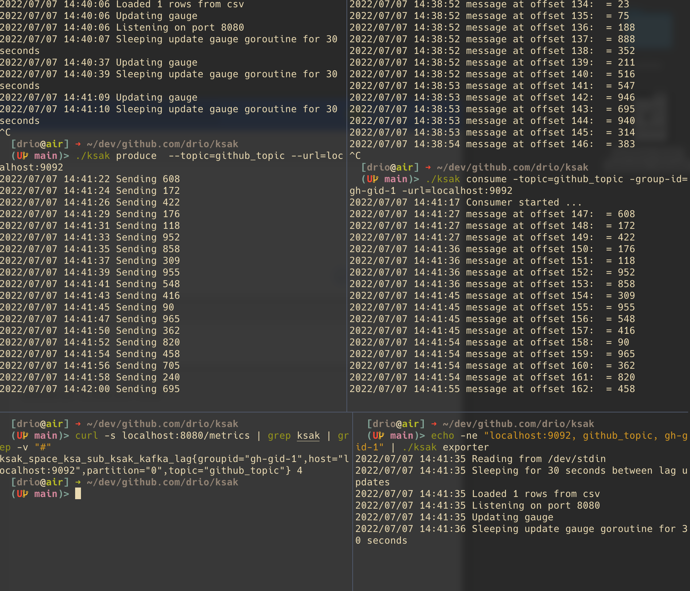

## ksak: useful kafka tasks 

This tool implements different tasks that I use regularly when working against a 
kafka server. See the help for more details on those tasks: produce, consume, check
for lag.

It also comes with a kafka exporter that exposes lag as a prometheus metric (gauge).

### Basics

```

# Produce some messages in a topic
$ ./ksak produce  --topic=github_topic --url=localhost:9092
2022/07/07 14:33:40 Sending 130
2022/07/07 14:33:42 Sending 338
...

In another terminal, we can consume them:

./ksak consume -topic=github_topic -group-id=gh-gid-1 -url=localhost:9092
2022/07/07 14:35:14 Consumer started ...
2022/07/07 14:35:24 message at offset 0:  = 130
2022/07/07 14:35:24 message at offset 1:  = 338
...

In another terminal, we can check for the lag on that topic/groupid:

./ksak lag -topic=github_topic  -url=localhost:9092 -group-id=gh-gid-1
{partition:0 committed:53 last:71 lag:18 topic:github_topic groupId:gh-gid-1}%

Here we can see that the consumers in group-id=gh-gid-1 still have 18 messages to process.
```

### The exporter

And we could start a prometheus exporter:

```
$ echo -ne "localhost:9092, github_topic, gh-gid-1" | ./ksak exporter
2022/07/07 14:39:21 Reading from /dev/stdin
2022/07/07 14:39:21 Sleeping for 30 seconds between lag updates
2022/07/07 14:39:21 Loaded 1 rows from csv
2022/07/07 14:39:21 Listening on port 8080
2022/07/07 14:39:21 Updating gauge
2022/07/07 14:39:22 Sleeping update gauge goroutine for 30 seconds
...

Then we can check the metric with:

$ curl -s localhost:8080/metrics | grep ksak | grep -v "#"
ksak_space_ksa_sub_ksak_kafka_lag{groupid="gh-gid-1",host="localhost:9092",partition="0",topic="github_topic"} 12 
```


